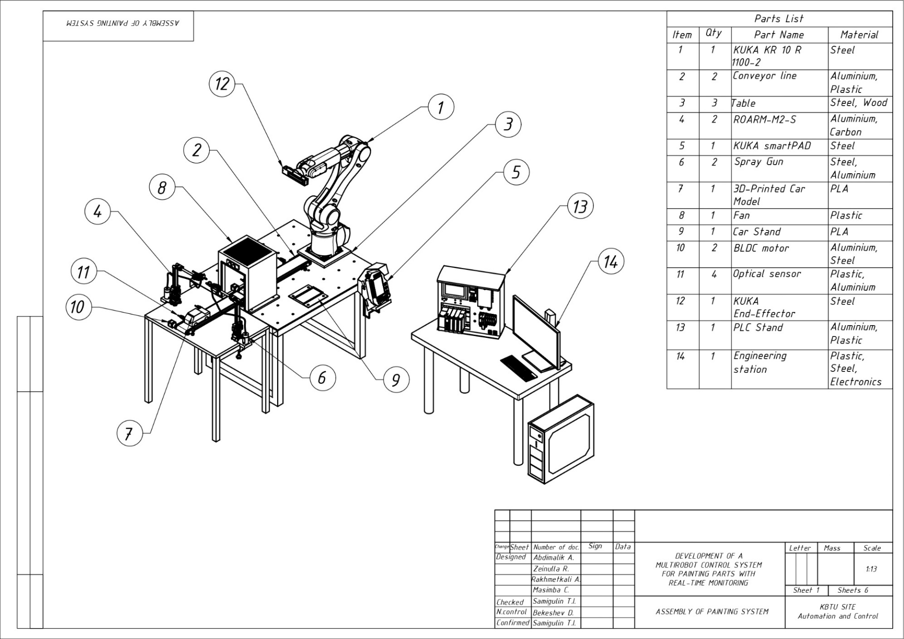
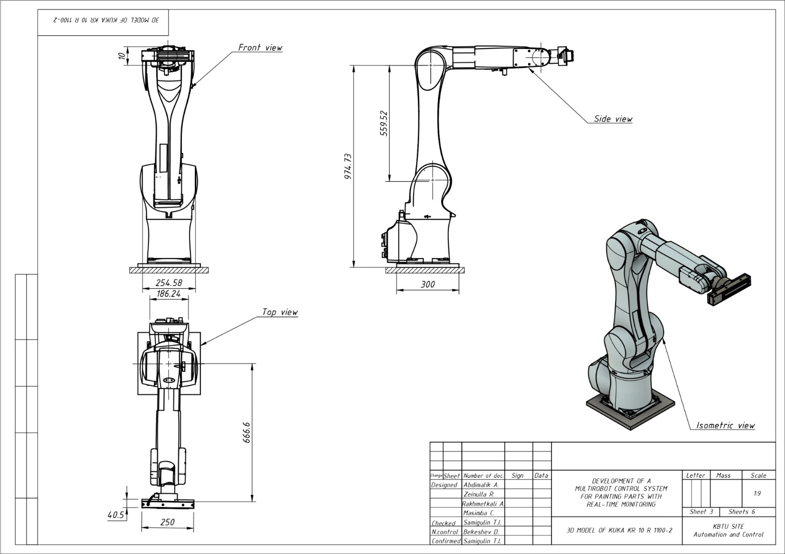
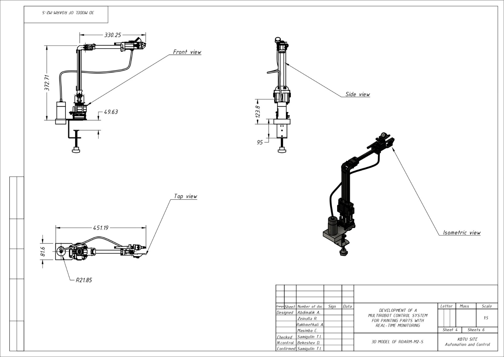
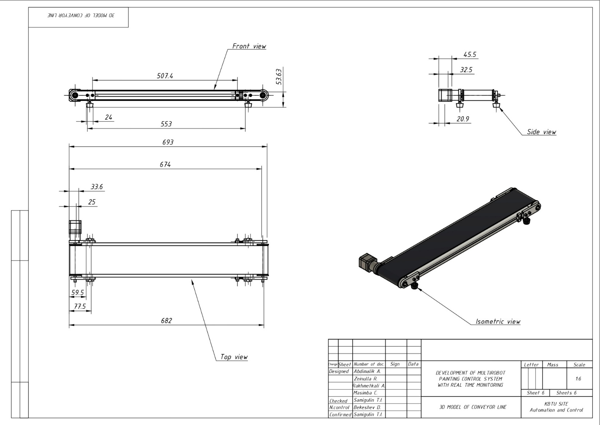
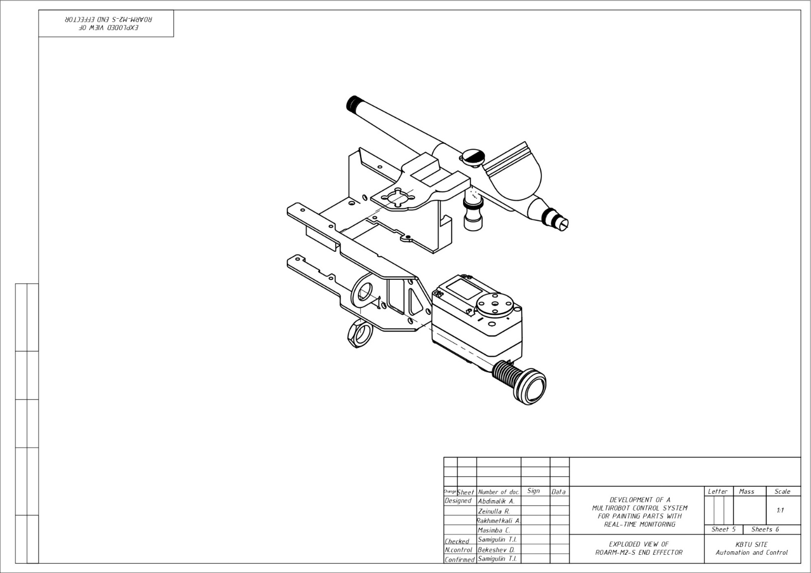

# CAD — Mechanical Design & Drawings

Mechanical and engineering design documentation for the multirobot painting cell: 3D assemblies of the full system and 2D drawings of the individual components, robots, work areas, and electrical scheme.

 <em>General assembly of the painting cell, with the full parts list</em>

## 3D models — `3D_model/`

Neutral-format **STEP (ISO 10303)** assemblies, importable into any CAD package:

| File | Represents |
|---|---|
| `industrial_process_3d_model.step` | The full-scale **industrial** painting cell — production-grade layout with the industrial KUKA robot, conveyor, and supporting equipment as deployed on a real line. |
| `laboratory_process_3d_model.step` | The scaled-down **laboratory** cell — the benchtop prototype (RoArm manipulators, lab table/conveyor) used to develop and validate the control system. |

The two models capture the same painting concept at two fidelities: the real production target and the research prototype.

> ⚠️ **Large files.** These STEP models are several hundred MB each and exceed GitHub's 100 MB per-file limit. See [Note on large files](#note-on-large-files) below before pushing.

## 2D drawings — `autocad_drawings/`

AutoCAD-exported PDF sheets:

| Drawing | Content |
|---|---|
| `Assembly.pdf` | General assembly of the complete painting cell. |
| `Conveyor.pdf` | Conveyor mechanism that transports workpieces through the station. |
| `CTE.pdf` | Control / technological scheme (process flow and control logic). |
| `Electrical.pdf` | Electrical schematic / wiring diagram (power, signal, control). |
| `KUKA_Kinematics.pdf` | Kinematic diagram of the KUKA robot (joints, links, axes). |
| `KUKA_Model.pdf` | Mechanical drawing of the KUKA manipulator. |
| `KUKA_work_area.pdf` | KUKA reach / working-envelope drawing. |
| `RoArm_Model.pdf` | Mechanical drawing of the RoArm-M2-S manipulator. |
| `Table.pdf` | Work table / workpiece support fixture. |

### Preview

| KUKA model | RoArm model | Conveyor |
|:---:|:---:|:---:|
|  |  |  |

 <em>Exploded view of the RoArm-M2-S spray-gun end-effector</em>

## Note on large files

The `.step` models exceed **GitHub's 100 MB hard per-file limit**, so a normal `git push` containing them will be **rejected**. Options:

- **Git LFS** — track them with `git lfs track "*.step"` before committing (recommended if you want them in the repo).
- **External hosting** — keep the models on cloud storage / a release asset and link to them here.
- **Compress** — distribute as zipped archives if they fall under the limit.
