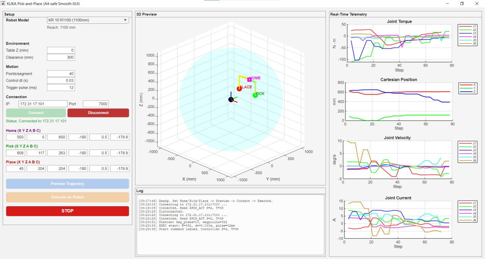
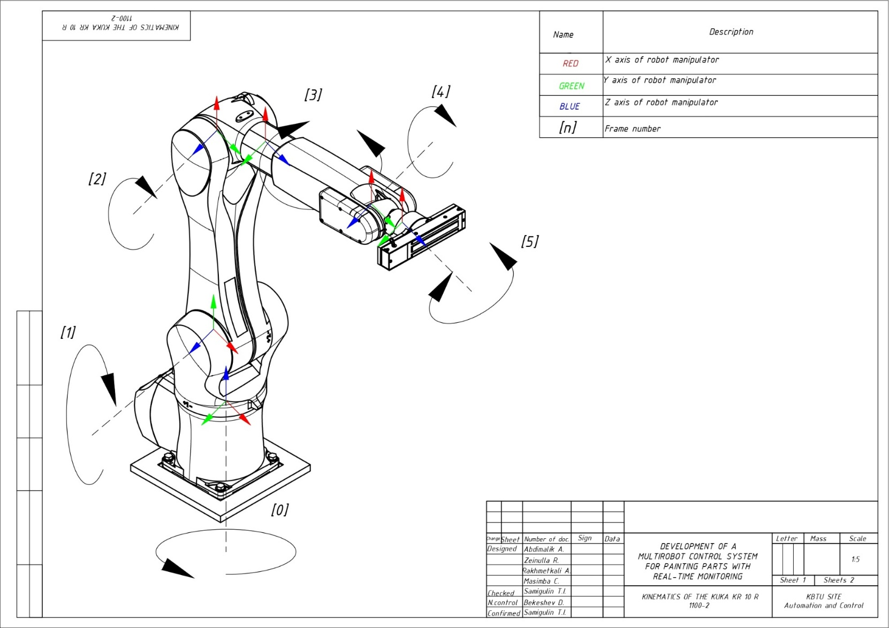
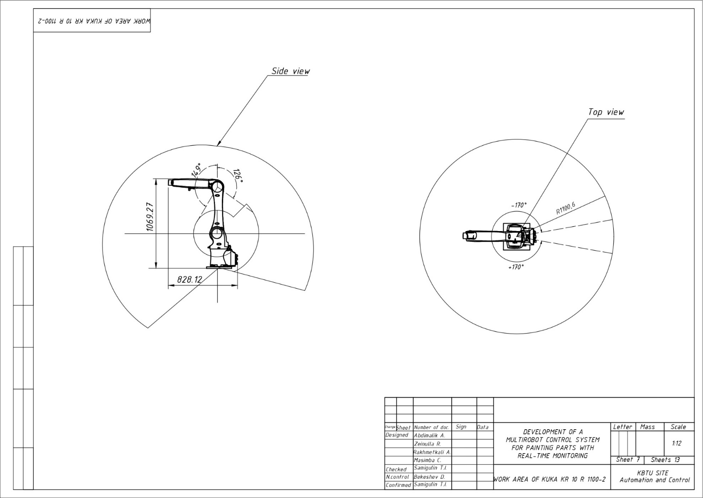
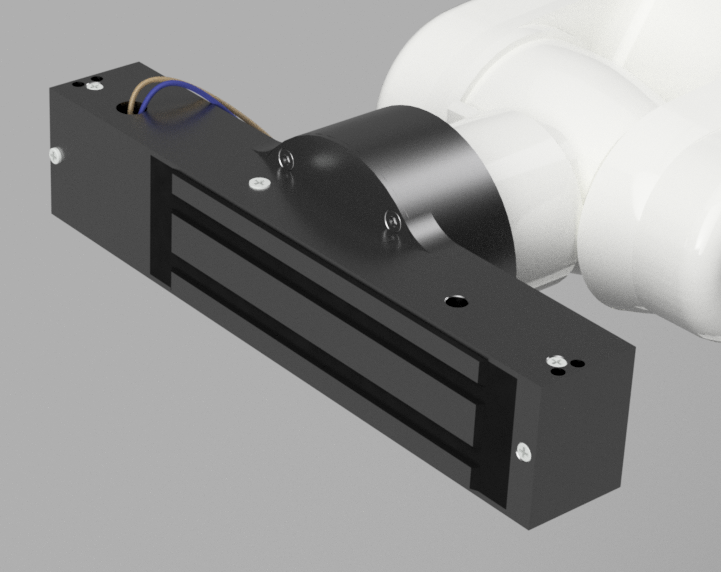
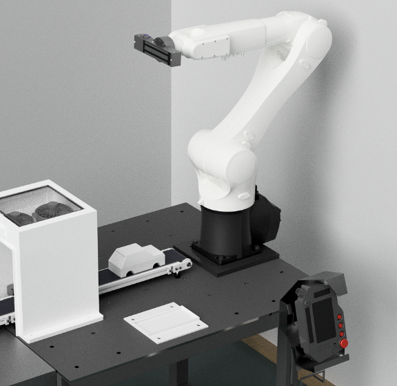

# KUKA KR10 R1100-2 — MATLAB Pick-and-Place Control

MATLAB control, kinematics/dynamics, trajectory planning, and visualization for a 6-DOF **KUKA KR Agilus** robot (default target: **KR10 R1100-2**, KRC4 Compact controller). The robot picks finished parts off the conveyor and places them on the output platform, as the handling stage of the [multirobot painting cell](../../README.md).

<div align="center">

<br/><em>The pick-and-place GUI: pose editor, 3D trajectory preview, and real-time joint telemetry</em>
</div>

## What it does

- Connects to the physical robot over Wi-Fi/TCP-IP using **[KukaVarProxy](https://github.com/ImtsSrl/KUKAVARPROXY)** (port **7000**), reading/writing KRL global variables.
- Generates smooth, singularity-aware pick-and-place trajectories using **quintic smoothstep** interpolation.
- Streams dense waypoints to the robot at **~83 Hz** (12 ms control period) with live joint-limit guards.
- Displays **real-time telemetry** — joint torque, Cartesian position, joint velocity, and joint current per axis.
- Drives a **magnetic** or **vacuum** end-effector through the KUKA controller's digital outputs.
- Ships a self-contained `srcs/` robotics library (FK/IK/ID solvers, trajectory generators, Simulink simulation) for offline development.

## How control works

MATLAB never commands the robot motors directly. Instead:

1. A KRL program (`MatlabControl.src` / `MatLabControl.dat`) runs on the KUKA smartPAD and **polls global variables** (`target_pos`, `move_trigger`, `magnetic_cmd` / `vacuum_cmd`).
2. MATLAB writes a target pose, then pulses `move_trigger`; the KRL program executes the motion and resets the flag.
3. The KRL program mirrors the gripper command BOOL to a physical digital output (`$OUT[25]` magnetic, `$OUT[24]` vacuum).

This handshake gives synchronous flow control at the cost of one round-trip per waypoint (acceptable since inter-waypoint intervals are ≥ 12 ms).

## Robot model & workspace

<div align="center">

| Kinematic structure | Working envelope |
|:---:|:---:|
|  |  |
| *6 axes — frames color-coded X/Y/Z = red/green/blue* | *Reach envelope, R1100.6 mm, ±170° base rotation* |

</div>

The magnetic end-effector (switched through the KUKA controller's `$OUT[25]` digital output) and a typical pick over the conveyor:

<div align="center">

&nbsp;&nbsp;

</div>

## File overview

### Top level

| File | Description |
|---|---|
| `kuka_pick_and_place_gui_magnetic.m` | **Main GUI** — magnetic end-effector. App-style interface (pose editor, 3D preview, telemetry, execute/abort). |
| `kuka_pick_and_place_gui_vacuum.m` | Main GUI — vacuum-gripper variant. |
| `create_pick_and_place_trajectory.m` | Interactive script: builds 10 safe key poses, densifies them with quintic smoothstep, validates reach/limits, saves `trajectory_pick_place_<timestamp>.mat`. |
| `excecute_pick_and_place_trajectory.m` | Loads a saved trajectory, runs a safety checklist, connects, and streams waypoints with live plots and A4/A5 guards; saves an execution log. |
| `Environment_setup.m` | One-time path setup — adds `srcs/` to the MATLAB path. *(Edit the hard-coded path before first run.)* |
| `KukaTest_Connection.m` | Minimal smoke test of the KukaVarProxy round-trip. |
| `MatlabControl.src` / `MatLabControl.dat` | KRL program + data block to create on the controller (see Setup). |
| `Kuka6DoF.mlx`, `KukaKR.mlx`, `KukaKR60.mlx` | Live-script kinematics/dynamics notebooks. |

### `srcs/` — robotics library

```
srcs/
├── matlab/
│   ├── +core/        Kuka6 (FK/IK/ID System Object) · TrajectoryGenerator
│   ├── +solver/      computeT · solveForwardKinematics · solveInverseKinematics · solveInverseDynamic
│   ├── +trajectory/  cubic/quintic polynomials · Euler→quaternion/rotation conversions
│   ├── +enum/        SpaceEnum (TaskSpace / JointSpace)
│   ├── loadDHParams · loadDynamicParams · loadWaypoints · plotWaypoints · printlog · ...
│   └── test/         InverseKinematicTest · InverseDynamicTest (matlab.unittest)
├── data/             gen_waypointSet_00..05 (waypoint generators)
└── simulink/         KukaSimModel · KukaVisualizationModel · lib_Solver · sim_kuka_model_ik
```

- **Inverse kinematics** — damped least-squares (Levenberg–Marquardt) with an analytic geometric Jacobian.
- **Inverse dynamics** — recursive Newton–Euler returning joint torques.
- **Trajectory generation** — cubic / quintic polynomials, optional SLERP orientation interpolation.

## Trajectory & safety design

- **Key poses:** ~10 analytically parameterized Cartesian poses (home → approach-pick → pick → lift → intermediate → transition → approach-place → place → lift → home).
- **Singularity avoidance:** orientation fixed at `A = -180°, B = 2°, C = -180°` (small B, tool pointing down) to avoid the wrist singularity; an extra Y-displaced intermediate waypoint keeps A4 away from its ±170° limit.
- **Smoothing:** quintic smoothstep `S(t) = 6t⁵ − 15t⁴ + 10t³` (zero velocity and acceleration at segment ends), ~40 points/segment → ~351 waypoints.
- **Runtime guards:** A4 and A5 are polled every 0.3 s; exceeding limits (|A4| > 170°, |A5| > 110°) suspends motion and aborts the robot home if the condition persists.

## Setup

### Prerequisites

1. **MATLAB R2025b** with the **Instrument Control Toolbox** (for `tcpclient` / TCP-IP). Simulink for the `srcs/simulink` models; Robotics System Toolbox for tests.
2. **Administrative (expert) access** to the KUKA smartPAD.
3. **KukaVarProxy** running on the KRC4 controller, listening on **port 7000** — download/build from [github.com/ImtsSrl/KUKAVARPROXY](https://github.com/ImtsSrl/KUKAVARPROXY).
4. PC and robot on the **same subnet**; port 7000 not blocked by firewall. Start in **T1 (slow) mode**.

### 1 · Network configuration (KUKA controller)

Put the controller's KLI interface (*Virtual Network 5*) on the same subnet as your router. On the smartPAD (expert mode): *Menu → Start-up → Network configuration → Virtual5*. Use DHCP, or set a static IP (e.g. `192.168.1.10`, mask `255.255.255.0`, gateway = router IP) and reboot. Note the assigned IP.

### 2 · Verify connectivity

From the PC (same Wi-Fi): `ping <robot_IP>`. Replies confirm the link.

### 3 · Run KukaVarProxy on the controller

Copy `KukaVarProxy.exe` to the controller (USB → `C:\KRC\USER`), launch it; it listens on port 7000. Verify with `telnet <robot_IP> 7000` from the PC. Add a Windows Firewall exception for the executable on the controller if needed.

### 4 · Create the KRL program

On the smartPAD (expert mode): *Menu → Program → New*, create `MatlabControl.src` and `MatLabControl.dat` using the contents in this folder. Select and run it in **T1 mode** (key → T1, press the green run button); it waits for variable changes.

> ⚠️ **Safety:** always hold the deadman switch, start at low velocity, and keep targets inside the robot workspace.

## Running it

**GUI workflow (recommended)**

```matlab
kuka_pick_and_place_gui_magnetic     % or kuka_pick_and_place_gui_vacuum
```
Set Home/Pick/Place poses → **Preview Trajectory** → enter robot IP → **Connect** → **Test** the gripper → **Execute on Robot** (confirms a safety dialog). **STOP** is available at all times.

**Script workflow**

```matlab
Environment_setup                       % once per session (edit the path first)
KukaTest_Connection                     % verify the round-trip (set the IP)
create_pick_and_place_trajectory        % design + save a trajectory .mat
excecute_pick_and_place_trajectory      % load it, run the checklist, stream to robot
```

**Offline simulation**

```matlab
open srcs/simulink/KukaSimModel.slx     % dynamic simulation
runtests srcs/matlab/test               % validate the FK/IK/ID solvers
```

> ℹ️ Default robot IP differs per file: the GUIs / executor use `172.31.17.101`; `KukaTest_Connection.m` uses the placeholder `192.168.1.10`. **Set your robot's actual IP before running.**

## Troubleshooting

| Symptom | Fix |
|---|---|
| No connection | Check IP/subnet; confirm KukaVarProxy is running and port 7000 is open on both ends. |
| Variable errors | Ensure KRL variables are declared **global** and the `MatlabControl` program is running. |
| Robot doesn't move | Confirm T1 mode + deadman held; check the smartPAD for messages. |
| File transfer fails | Use Windows sharing on the controller, or another USB stick. |
