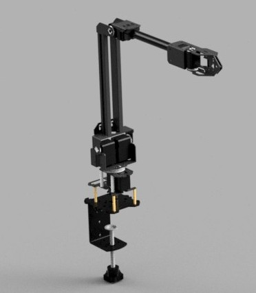
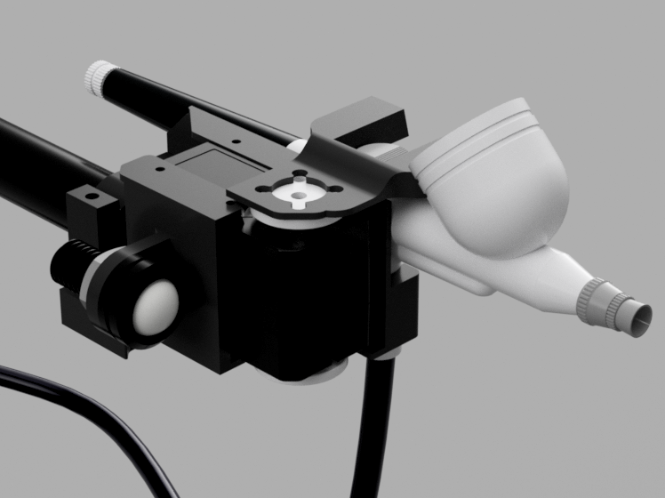
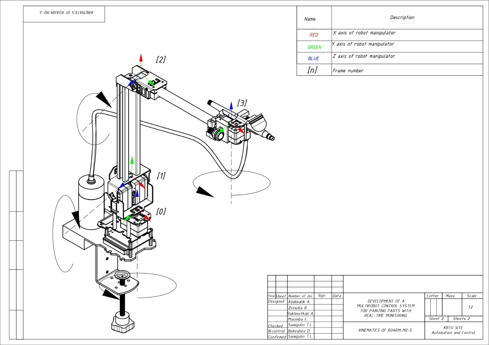
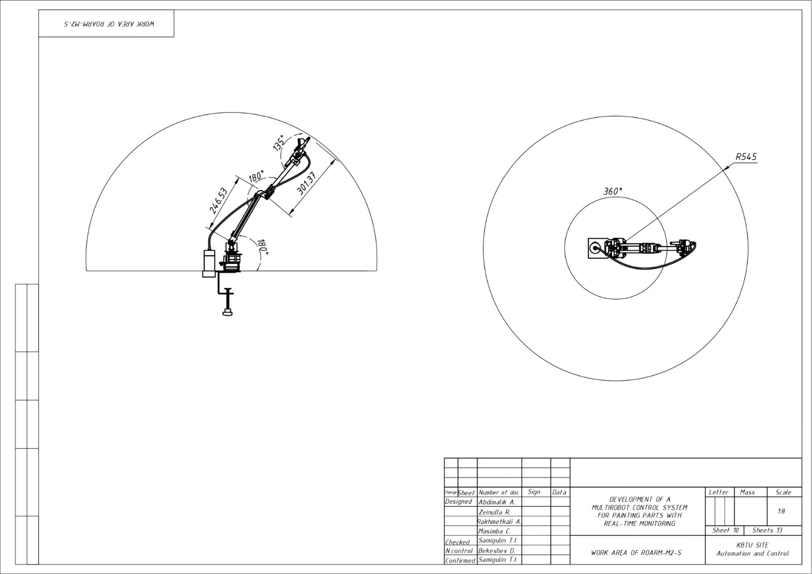
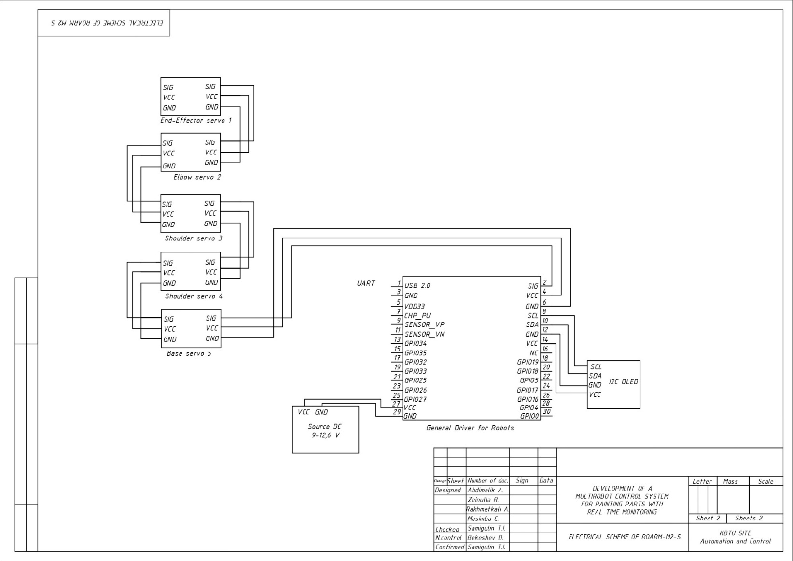

# RoArm-M2-S — MATLAB Painting Control

MATLAB motion control for **Waveshare RoArm-M2-S** 4-DOF manipulators — the spray-painting stage of the [multirobot painting cell](../../README.md). Two arms paint a workpiece **simultaneously** while it is held at the painting station, coordinated by the MATLAB supervisory layer.

<div align="center">

&nbsp;&nbsp;&nbsp;

</div>

> 🔗 Robot reference: [github.com/waveshareteam/roarm_m2](https://github.com/waveshareteam/roarm_m2) · [Waveshare RoArm-M2-S wiki](https://www.waveshare.com/wiki/RoArm-M2-S)

<div align="center">

<br/><em>The dual-arm painting controller: per-arm jog, workspace preview, path planning, live telemetry</em>
</div>

## Robot at a glance

| Property | Value |
|---|---|
| DOF | 4 — Base · Shoulder · Elbow · End-Effector (gripper/wrist) |
| Controller | ESP32-WROOM-32 (HTTP/JSON server) |
| Payload | 0.5 kg @ 0.5 m |
| Workspace | ~500 mm radius, 360° omnidirectional |
| Interfaces | Wi-Fi · UART/USB (115200 baud) · HTTP/JSON |
| Coordinate frame | right-handed (X forward, Y left, Z up), mm / degrees |
| Joint limits | Base ±180° · Shoulder ±90° · Elbow [-45°, 180°] · End-Effector [45°, 315°] |

<div align="center">

| Kinematic structure | Working envelope | Wiring (ESP32) |
|:---:|:---:|:---:|
|  |  |  |

</div>

## Module layout

The package has three layers — **single-arm control classes**, **demo/reference scripts**, and a **dual-arm painting application**.

### Control classes (single arm)

Two interchangeable classes with the **same method names** but different transports:

| Class | Transport | Construct with |
|---|---|---|
| `RoarmM2_MotionControl_v2` | Serial / USB (115200 baud) | `RoarmM2_MotionControl_v2('COM3')` *(omit port → simulation)* |
| `RoarmM2_MotionControl_WiFi` | Wi-Fi / HTTP | `RoarmM2_MotionControl_WiFi('192.168.4.1')` |

Both speak the same JSON command set (`T=` command ids):

| Method | Command | Notes |
|---|---|---|
| `moveHome()` | `T:100` | resets joints to `[0, 0, 90, 180]°` |
| `moveToJointAngles([b,s,e,h])` | `T:122` | validated against joint limits |
| `moveSingleJoint(joint, angle, spd, acc)` | `T:121` | joint 1–4 |
| `moveToCartesian([x,y,z], handAngle)` | `T:1041` | non-blocking XYZ (mm); on-board IK |
| `controlEndEffector(angle, spd, acc)` | `T:106` | gripper/wrist (~180 closed, ~45 open) |
| `getFeedback()` | `T:105` | pose / torque feedback |
| `setTorque(state)` | `T:210` | 1 = lock joints, 0 = release for manual movement |

JSON is built with `sprintf` into compact `{"T":..,...}` strings and sent over serial (`fwrite`) or HTTP (`webread` to `http://<ip>/js?json=<json>`). Without a port/IP the classes print `[SIM]` so commands can be dry-run without hardware.

### Demo & reference scripts

| Script | Purpose |
|---|---|
| `RoarmM2_CompleteExample.m` | 13-step guided example (init → joint/Cartesian moves → gripper → pick-and-place → patterns → cleanup). **Best starting point.** |
| `RoarmM2_QuickReference.m` / `RoarmM2_Demo.m` | Short copy-paste snippets. |
| `RoarmM2_WiFi_Demo.m` | Real-time telemetry plotting over HTTP. |
| `Roarm_config.m` / `go_to_point.m` | Standalone single-arm **terminal** controller (type `[x y z]`, `home`, `exit`). |
| `GETTING_STARTED.m` · `INDEX.m` · `README.m` | In-MATLAB documentation. |

### Dual-arm painting application

**`roarms_painting_process.m`** (`roarms_painting_process_updated()`) — a self-contained `uifigure` GUI: *"RoArm-M2-S One-Station Painting Controller"*. It is the production entry point for the painting stage.

- **Config** (`buildConfig`) — table geometry, the two arm base positions, link lengths, reach limits, painting parameters (stripe height, standoff, speed), and the two arm IPs.
- **Kinematics** — per-arm frame transforms (ARM 2 mirrored 180°), reachability checks, 2-link inverse kinematics, gravity-torque estimation for telemetry.
- **HTTP comms** — `httpSend` (GET with retries), status polling (`T:105`), arrival waiting within a settle tolerance.
- **Path generation** — boustrophedon (zig-zag) stripe paths over the side and top faces; ARM 1 paints the left half, ARM 2 the right half, split at the object mid-X.
- **Execution** — transforms each waypoint to local coordinates, reachability-checks, sends `T:104` Cartesian motion, waits for arrival, and updates 3D + telemetry plots. Skips unreachable points; aborts after 5 consecutive failures.
- **Controls** — **Ping · HOME · Telemetry · START PAINTING · STOP** (STOP sends an emergency `{"T":0}` to both arms).

## Network setup

The RoArm-M2-S supports two Wi-Fi modes:

- **AP mode (default)** — each arm is its own hotspot (SSID `RoArm-M2`, password `12345678`, IP `192.168.4.1`).
- **STA mode (required here)** — both arms and the MATLAB host join one router/subnet, so they can be controlled together.

**Switch each arm to STA mode:**
1. Connect the PC to the arm's AP hotspot, open `http://192.168.4.1`.
2. Go to **WiFi Settings → STA Mode**, select your router SSID, enter the password, save, and reboot.
3. After reboot, the OLED shows the router-assigned IP (e.g. `172.31.17.193`). Repeat for the second arm.
4. Verify from the PC: `ping <arm_IP>`.

> Configure the two arm IPs in `buildConfig` (painting app) or in the class constructor before running.

## Running it

```matlab
% --- Learn the API (no hardware needed) ---
RoarmM2_CompleteExample                 % runs in simulation by default

% --- Single arm, programmatic (serial) ---
robot = RoarmM2_MotionControl_v2('COM3');
robot.moveHome();
robot.moveToJointAngles([0, 30, 90, 180]);
robot.disconnect();

% --- Single arm, Wi-Fi ---
robot = RoarmM2_MotionControl_WiFi('172.31.17.193');
robot.moveHome();
robot.moveToCartesian([250, 0, 150], 180);
robot.disconnect();

% --- Dual-arm painting (GUI) ---
roarms_painting_process                 % Ping both arms, HOME, then START PAINTING
```

## Prerequisites

- **MATLAB** (R2019b or later for `webread`/`weboptions`).
- A powered RoArm-M2-S (7–12.6 V; recommended **12 V / 5 A**).
- A USB-C connection (find the COM port in Device Manager) **or** a Wi-Fi connection (STA mode, see above).
- For the dual-arm app: **two arms** reachable at the configured IPs on the same network.

> ℹ️ Some file headers reference an older folder layout ("December 2024 / Version 2.0") and a stale `sim-kuka-robot-master` path — these are historical and do not affect the current scripts.
