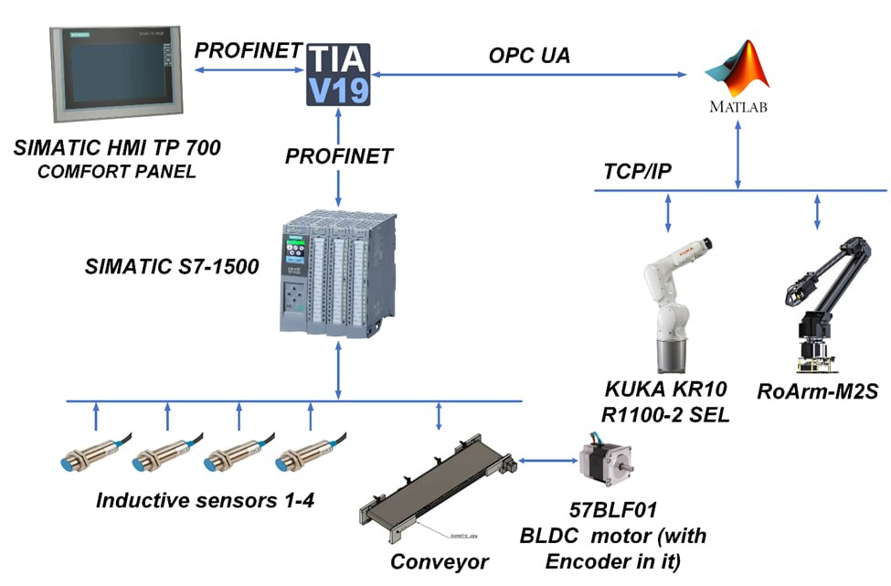
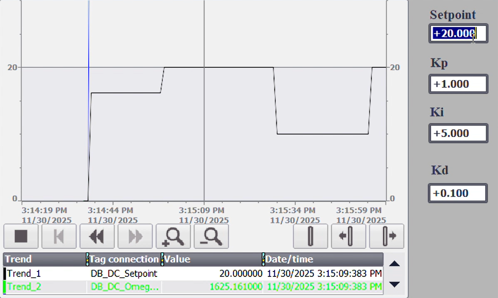
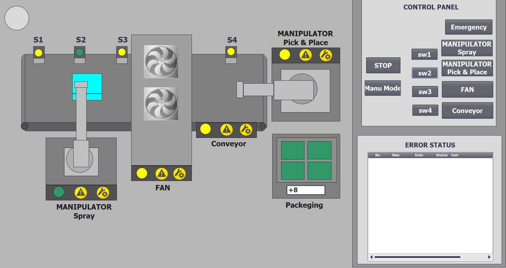
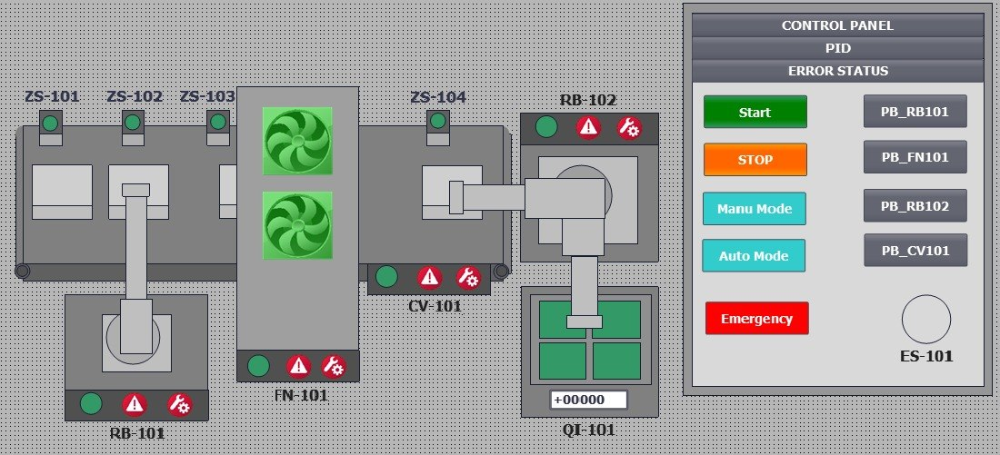
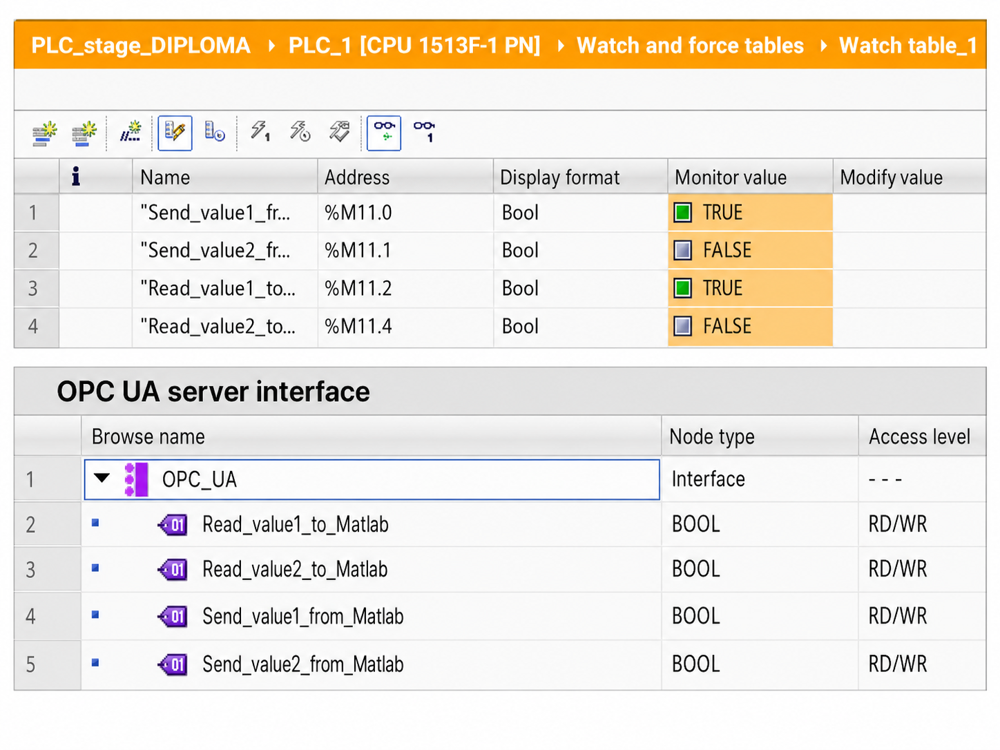

# PLC / SCADA / HMI — Siemens S7-1500 (TIA Portal V19)

The industrial control backbone of the painting cell: a **Siemens SIMATIC S7-1500** program with an integrated **WinCC HMI / SCADA**, developed in **TIA Portal V19**. The PLC is the deterministic sequencer and safety authority — it indexes the conveyor, manages the drying zone, exchanges handshakes with the robots, and runs the conveyor-speed PID. The MATLAB supervisory layer connects to it over **OPC UA** (50 ms refresh).

 <em>Network topology: PROFINET to field devices and HMI, OPC UA to MATLAB</em>

## Controller & hardware

| Function | Module | Part number |
|---|---|---|
| CPU (fail-safe) | SIMATIC S7-1513F-1 PN | 6ES7 513-1FL02-0AB0 |
| Digital input (32 ch) | SM 521 | 6ES7521-1BL00-0AB0 |
| Digital output (32 ch) | SM 522 | 6ES7522-1BL01-0AB0 |
| Analog input (8 ch) | SM 531 | 6ES7531-7KF00-0AB0 |
| Power supply | PM 1507 | 6EP1332-4BA00 |
| Operator panel | SIMATIC HMI TP700 Comfort | 6AV2124-0GC01-0AX0 |

The CPU exposes a built-in **OPC UA server** (all process tags) and connects every field device — 4 inductive sensors, the conveyor drive, the I/O modules, and the HMI — over a single **PROFINET** line (sensor latency < 1 ms; HMI refresh 500 ms).

## Project files

| Path | What it is | How to open |
|---|---|---|
| `PLC_SCADA_HMI.zap19` | **Portable project archive** (~18 MB) — the recommended single-file deliverable. | TIA Portal V19 → *Project → Retrieve…* |
| `PLC_SCADA_HMI/PLC_SCADA_HMI.ap19` | Primary project entry file (unpacked working copy). | Double-click / *Project → Open* |
| `PLC_SCADA_HMI/PLC_stage_PREDIPLOMA/.../PLC_stage_PREDIPLOMA.ap19` | Earlier pre-diploma development milestone (nested sub-project). | *Project → Open* |

> 💡 **To open the project, use `PLC_SCADA_HMI.zap19` via *Project → Retrieve*.** It is a clean, self-contained snapshot. The rest of the `PLC_SCADA_HMI/` tree is the IDE's unpacked working state (databases, runtime-generation output, search indexes) and is regenerated automatically.

## Control logic

The PLC enforces the technological order — the conveyor moves only after the previous operation completes, the painting arms are enabled only when the workpiece reaches the paint position, and the KUKA pick command is issued only after drying completes.

**Operating modes:** Automatic (continuous cycling) · Manual (per-device jog for commissioning) · Stop (safe cycle interrupt) · Emergency Stop (immediately disables all actuators). Mode transitions are PLC-governed.

**Safety handshake:** the PLC publishes a *zone-clear* flag (set only when all safety zones are unoccupied, E-stop circuits are healthy, and supply pressure is within tolerance). MATLAB holds each robot at its current waypoint until the flag asserts. On a mid-stroke E-stop, the PLC forces the robot controllers into a hold state and latches a fault code in the HMI alarm log.

## Conveyor speed PID

The conveyor belt (57BLF01 BLDC motor) runs under closed-loop **PID speed control on the S7-1500** — setpoint from the HMI, feedback from the motor encoder, output to the motor driver — so the belt holds a constant takt regardless of load. Operators tune and monitor it from a dedicated HMI screen.

 <em>PID screen — editable setpoint and Kp/Ki/Kd, with a live setpoint-vs-feedback trend</em>

> A detailed control-theory study of the conveyor drive (modeling, controller synthesis, stability) is planned as a separate repository.

## HMI (WinCC)

Developed in **WinCC** for the TP700 Comfort panel:

- **Overview** — graphical conveyor / paint / dry / pick-and-place with color-coded status (green = running, red = stopped/fault).
- **Control panel** — mode selector, E-stop acknowledge, interlock indicators.
- **Automatic / Manual screens** — conveyor position, robot status, drying timer, cycle counter; per-device jog buttons (locked when an interlock is unmet).
- **Alarms** — sensor errors, E-stops, robot communication failures.
- **PID screen** — editable setpoint, live process value/output, mode selection, and a trend graph of setpoint vs. feedback vs. output.

| Process overview | Control panel |
|:---:|:---:|
|  |  |

## MATLAB integration (OPC UA)

The CPU's built-in OPC UA server exposes the process tags MATLAB reads and writes. The handshake variables are watched in TIA Portal during commissioning:

 <em>Watch table + OPC UA interface — <code>Read/Send_value*_from/to_Matlab</code> handshake tags</em>

## Requirements

- **Siemens TIA Portal V19** (STEP 7 Professional + WinCC Advanced/Comfort).
- **WinCC Runtime Advanced** for SCADA runtime.
- SIMATIC S7-1500 hardware as listed above (or PLCSIM for simulation).
