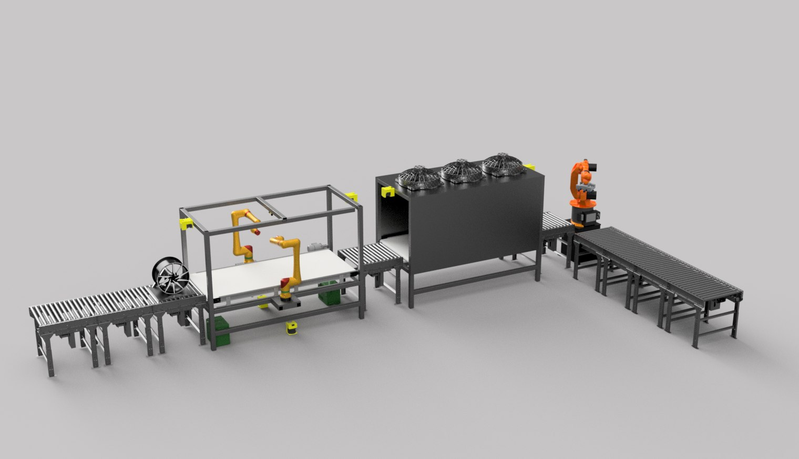
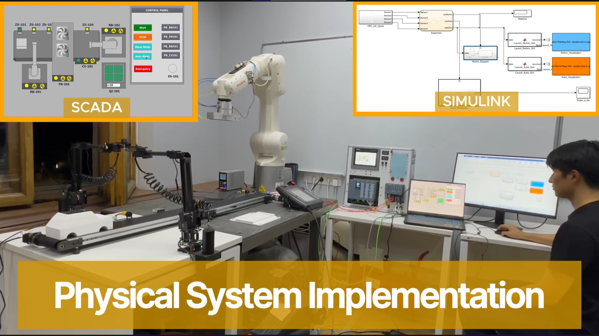
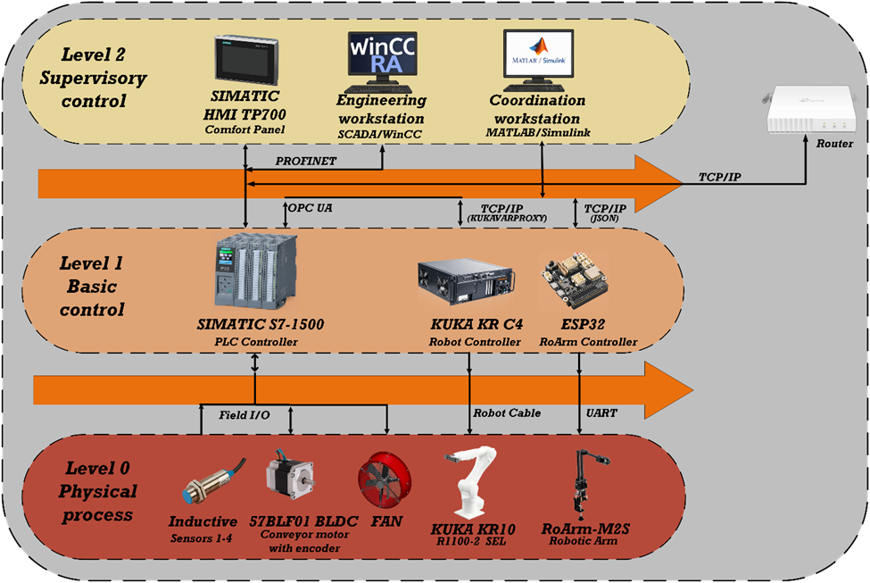
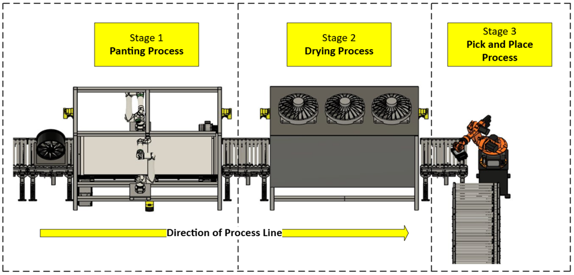
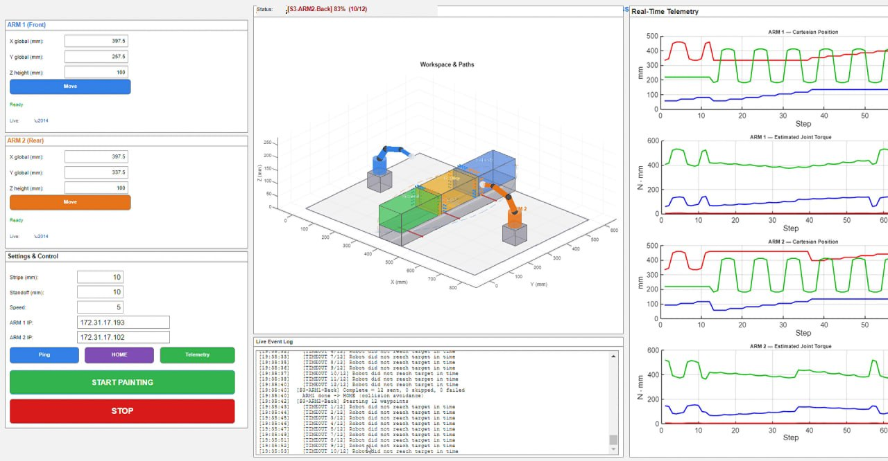
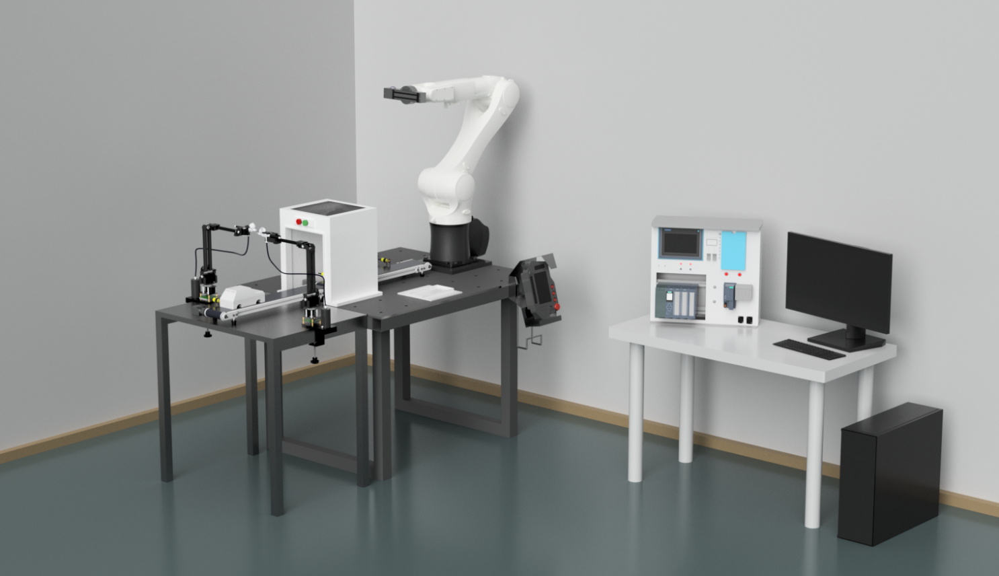
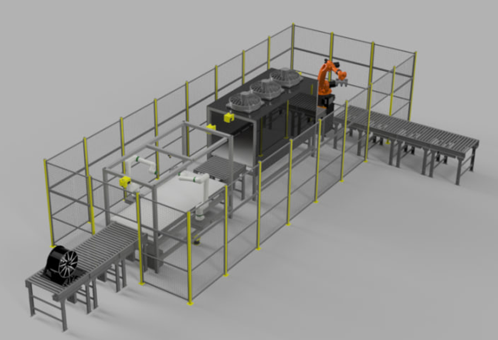

<div align="center">

# 🎨 Multirobot Control System for Automated Part Painting

### Distributed multi-robot painting line with real-time monitoring

A unified precision-painting platform that coordinates **two collaborative painting arms**, **one industrial pick-and-place robot**, and a **conveyor line** under a single automated cycle — combining PLC-grade industrial reliability with a MATLAB-based supervisory layer.

[](https://www.mathworks.com/)
[](https://www.mathworks.com/products/simulink.html)
[](https://www.siemens.com/tia-portal)
[](https://www.siemens.com/)
[](LICENSE)


<br/>



</div>

---

## 📖 Overview

This repository contains the engineering work, control software, simulation models, and design documentation for a **distributed multirobot control system with real-time monitoring for an automated industrial painting line**, developed as a graduation (diploma) project at the **Kazakh-British Technical University (KBTU)**.

The system automates the full technological cycle of part finishing — **workpiece transport → simultaneous spray painting → drying → pick-and-place handling** — and synchronizes three heterogeneous robots and a conveyor within one production cycle. The process is modeled on a real automotive painting line at *Hyundai Trans Kazakhstan* and realized at laboratory scale, while the software is built to industrial standards for future scale-up.

The core engineering idea is a **hybrid PLC + MATLAB architecture**: the Siemens S7-1500 PLC handles deterministic sequencing, safety interlocks, and field-device I/O, while a MATLAB supervisory layer handles high-level trajectory generation, multi-robot coordination, and real-time telemetry.

> 📄 This work is based on the graduation thesis *"Development of a multirobot control system for painting parts with real-time monitoring"* (KBTU, 2026). Read the **[full thesis (PDF)](docs/Diploma_Final.pdf)** and the **[presentation slides (PDF)](docs/Diploma_presentation.pdf)**.

---

## 📹 Demo

<div align="center">

[](https://youtu.be/CDdXuiCqLzY)

▶️ **[Watch the full system in action on YouTube](https://youtu.be/CDdXuiCqLzY)**  ·  🖥️ **[Presentation slides (PDF)](docs/Diploma_presentation.pdf)**

</div>

---

## ✨ Highlights

- 🤖 **Three coordinated robots** — two Waveshare **RoArm-M2-S** spray arms + one **KUKA KR10 R1100-2** industrial pick-and-place robot.
- 🏭 **Industrial PLC backbone** — Siemens **SIMATIC S7-1500 (S7-1513F-1 PN)** programmed in **TIA Portal V19**, with a **WinCC** HMI for real-time visualization and operator control.
- 🔗 **Multi-protocol communication** — **PROFINET** at field level, **OPC UA** (50 ms) for PLC↔MATLAB supervision, **TCP/IP (KukaVarProxy)** for the KUKA, and **HTTP/JSON over Wi-Fi** for the painting arms.
- ⚙️ **Closed-loop conveyor** — a BLDC-driven conveyor belt with **PLC PID speed control** holds a constant takt for synchronized painting.
- 🛠️ **Built & validated** — realized as a **1:1 laboratory cell** and validated end-to-end (KUKA + 2× RoArm + conveyor + S7-1500 + SCADA).
- 💰 **Proven business case** — **≈ 45 % lower labor cost**, **≈ 6.08 M KZT annual economic effect**, and a **2.2-year payback**.

---

## 🏗️ System Architecture

The platform follows a **three-tier, fully network-based architecture** that decouples the supervisory host from device-level implementations, so hardware can be reconfigured without rewriting control logic.

<div align="center">

</div>

| Tier | Responsibility | Components |
|---|---|---|
| **Level 2 — Supervisory** | High-level control, coordination, monitoring, operator UI | MATLAB/Simulink · WinCC SCADA · TP700 Comfort HMI |
| **Level 1 — Basic control** | Deterministic sequencing, safety, device control | SIMATIC S7-1500 PLC · KUKA KR C4 · ESP32 (RoArm) |
| **Level 0 — Physical process** | Sensing & actuation | 4× inductive sensors · 57BLF01 conveyor drive · fan · KUKA · 2× RoArm |

MATLAB exchanges a **safety handshake** with the PLC over OPC UA (zone-clear flag, E-stop circuits, supply-pressure check) before releasing any robot motion.

### Process cycle

A workpiece moves through three stations — the conveyor carries it to the **painting** station (two arms spray simultaneously), then to the **drying** station (fan arch), then to the **pick-and-place** station where the KUKA unloads it to the output platform.

<div align="center">

</div>

Workpiece positioning at every stage is governed by **inductive proximity sensors**, and every stage transition is gated by a **PLC safety interlock** before the MATLAB layer releases the next robot motion.

---

## 🔧 Hardware

| Subsystem | Component | Model / Part No. | Key spec |
|---|---|---|---|
| Pick-and-place robot | KUKA Agilus | **KR10 R1100-2 / SEL** | 6-DOF, 10 kg payload, ±0.02 mm, 1101 mm reach |
| Painting manipulators (×2) | Waveshare | **RoArm-M2-S** | 4-DOF, ESP32, 0.5 kg payload, ~500 mm reach |
| Controller | SIMATIC S7-1500 | **CPU 1513F-1 PN** (6ES7 513-1FL02-0AB0) | fail-safe, PROFINET IRT, OPC UA server |
| I/O modules | SIMATIC | DI 6ES7521-1BL00 · DQ 6ES7522-1BL01 · AI 6ES7531-7KF00 | 32 DI / 32 DQ / 8 AI |
| Operator panel | SIMATIC HMI | **TP700 Comfort** (6AV2124-0GC01-0AX0) | 7″ touch, WinCC |
| Conveyor drive | BLDC motor + driver | **57BLF01** + **BLDC-8015A** | 24 V, 3000 RPM, 63 W, 0.2 Nm |
| Position sensing | Inductive proximity (×4) | Siemens 3RG40 22-3JB00 | 4 mm, IP67, PROFINET |
| End-effector | Electromagnetic gripper | 280 kg holding | switched via `$OUT[25]` |

📋 Full bill of materials with prices is in the [economic analysis](#-results).

---

## 💻 Software Stack

| Layer | Tooling |
|---|---|
| Supervisory control | **MATLAB R2025b** (Instrument Control Toolbox, Robotics System Toolbox) |
| Process dispatch & kinematics | **Simulink** (OPC UA sensor states → launch painting / pick-and-place) |
| PLC / SCADA / HMI | **Siemens TIA Portal V19** + **WinCC Runtime Advanced** |
| KUKA middleware | **KukaVarProxy** (open-source) over TCP/IP, port 7000 |
| RoArm firmware | ESP32 HTTP/JSON server (Waveshare stock firmware) |
| Mechanical design | **AutoCAD** (2D), **STEP / Fusion 360** (3D) |

---

## 📁 Repository Structure

```
multirobot_painting_control_system/
├── MATLAB/
│   ├── KUKA_control/        # KUKA KR10 pick-and-place: GUI, trajectory gen, kinematics/dynamics library
│   ├── Roarm_control/       # RoArm-M2-S painting: OOP control classes, dual-arm painting app
│   └── README.md
├── PLC/
│   ├── PLC_SCADA_HMI/       # Siemens TIA Portal V19 project (S7-1500 + WinCC HMI)
│   ├── PLC_SCADA_HMI.zap19  # portable project archive (open via Project → Retrieve)
│   └── README.md
├── Simulink/
│   ├── MultiRobotPaintingModel_fixed.slx   # supervisory model: OPC UA sensor states → launch painting / pick-and-place
│   └── README.md
├── CAD/
│   ├── 3D_model/            # STEP models (industrial + laboratory cells)
│   ├── autocad_drawings/    # 2D engineering drawings (PDF)
│   └── README.md
├── docs/
│   └── images/              # renders, screenshots, diagrams
├── LICENSE                  # MIT
├── CITATION.cff             # how to cite this work
└── README.md                # you are here
```

Each subsystem folder has its own README with detailed setup and usage instructions.

| Subsystem | What's inside | Docs |
|---|---|---|
| 🦾 **KUKA control** | Pick-and-place GUI, quintic-smoothstep trajectory generation, 6-DOF FK/IK/ID library, Simulink simulation | [MATLAB/KUKA_control](MATLAB/KUKA_control/README.md) |
| 🖌️ **RoArm control** | OOP motion-control classes (serial + Wi-Fi), dual-arm painting application, telemetry GUI | [MATLAB/Roarm_control](MATLAB/Roarm_control/README.md) |
| 🏭 **PLC / SCADA / HMI** | S7-1500 sequencing logic, conveyor PID, WinCC operator panel | [PLC](PLC/README.md) |
| 📊 **Simulink** | Supervisory dispatch model — OPC UA sensor states launch the painting / pick-and-place processes; robot kinematics | [Simulink](Simulink/README.md) |
| 📐 **CAD** | 3D STEP assemblies and 2D AutoCAD drawings | [CAD](CAD/README.md) |

---

## 📈 Results

### Economic impact

| Metric | Value |
|---|---|
| Total capital expenditure | ≈ **46.5 M KZT** (≈ \$50,874 BOM) |
| Annual labor-cost reduction | **≈ 44.8 %** (10 → 4 operators) |
| Total annual savings | ≈ 20.96 M KZT |
| **Annual economic effect** | ≈ **6.08 M KZT** |
| **Payback period** | **2.2 years** |

---

## 🚀 Getting Started

> Each subsystem is independent — start with the one you need. Full prerequisites and step-by-step instructions live in each subsystem README.

1. **KUKA pick-and-place** — run the MATLAB GUI `kuka_pick_and_place_gui_magnetic`, design Home/Pick/Place poses, preview the trajectory, then execute on the robot via KukaVarProxy. → [guide](MATLAB/KUKA_control/README.md)
2. **RoArm painting** — launch `roarms_painting_process` to control both arms over Wi-Fi, or use the `RoarmM2_MotionControl_*` classes programmatically. → [guide](MATLAB/Roarm_control/README.md)
3. **PLC / HMI** — open `PLC/PLC_SCADA_HMI.zap19` in TIA Portal V19 (*Project → Retrieve*). → [guide](PLC/README.md)
4. **Simulation** — open `Simulink/MultiRobotPaintingModel_fixed.slx` to explore the conveyor control model. → [guide](Simulink/README.md)

---

## 📷 Gallery

<div align="center">

| KUKA pick-and-place GUI | RoArm dual-arm painting GUI |
|:---:|:---:|
|  |  |
| *Pose editor, 3D preview, live joint telemetry, abort control* | *Dual-arm workspace preview, path planning, telemetry* |

| WinCC HMI control panel | Simulink supervisory model |
|:---:|:---:|
|  |  |
| *Conveyor, fans, robots, PID & error status* | *OPC UA inputs → supervisor → robot dispatch* |

| Laboratory cell (render) | Industrial cell (render) |
|:---:|:---:|
|  |  |

</div>

---

## 👥 Authors

Graduation project — **Kazakh-British Technical University (KBTU)**, School of Information Technology and Engineering, educational program *6B07103 "Automation and Control"*, 2026.

- **Almat Abdimalik**
- **Rassul Zeinulla**
- **Collins Masimba**
- **Ayan Rakhmetkali**

**Supervisor:** Associate Professor, PhD **T. I. Samigulin**

---

## 📝 Citation

If you reference this work, please cite it using the metadata in [`CITATION.cff`](CITATION.cff), or:

> A. Abdimalik, R. Zeinulla, C. Masimba, and A. Rakhmetkali, *"Development of a multirobot control system for painting parts with real-time monitoring,"* Graduation Project, Kazakh-British Technical University, Almaty, 2026.

---

## 📄 License

This project is released under the **MIT License** — see [`LICENSE`](LICENSE) for details.
