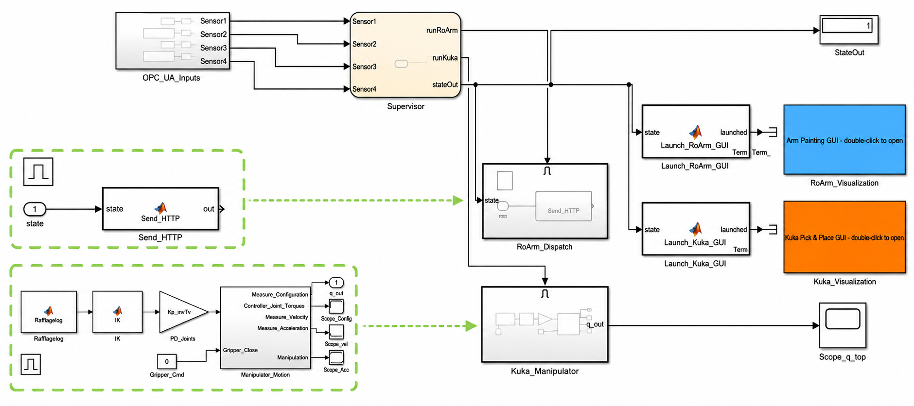
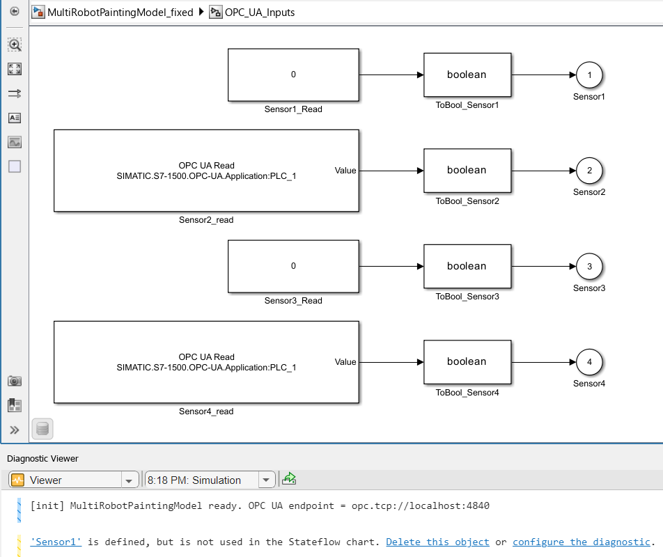

# Simulink — Supervisory Dispatch Model

The Simulink model is the **coordination brain** of the painting cell. It reads the inductive-sensor states that the PLC publishes over **OPC UA** and, based on where the workpiece is, decides **which process to launch** — the RoArm painting process or the KUKA pick-and-place process — handing off to the corresponding MATLAB GUI. It also holds the **robot kinematics math** used by those processes.

<div align="center">

| Supervisory model | OPC UA sensor inputs |
|:---:|:---:|
|  |  |
| *OPC UA inputs → Supervisor → RoArm / KUKA dispatch* | *`OPC UA Read` blocks bound to the S7-1500 server* |

</div>

## Contents

| File | Description |
|---|---|
| `MultiRobotPaintingModel_fixed.slx` | Supervisory dispatch model — reads inductive-sensor states from the PLC via OPC UA and launches the painting / pick-and-place processes; contains the robot kinematics. |

## What it does

1. **Reads sensor states (OPC UA).** TIA Portal exposes the four inductive proximity sensors on the S7-1500's OPC UA server. The model's `OPC UA Read` blocks subscribe to those tags.
2. **Decides which process to run.** A supervisor block evaluates the sensor states (workpiece at paint / drying / pick position) and triggers the matching subsystem.
3. **Launches the robot processes.** When a stage is due, the model starts the corresponding MATLAB GUI — the RoArm dual-arm painting process or the KUKA pick-and-place process — from a single entry point.
4. **Provides the kinematics.** The math inside the model is the forward/inverse kinematics for the robots, used to drive the launched processes.

So the whole cycle — sensors, PLC, MATLAB, RoArms, SCADA/HMI, and the KUKA — can be started and coordinated from this one model.

The conveyor belt has its own PID speed controller on the S7-1500 PLC (see [PLC](../PLC/README.md)). A dedicated control-theory study of the conveyor drive is planned as a separate repository.

## Running it

```matlab
open MultiRobotPaintingModel_fixed.slx   % open the model
% configure the OPC UA server address to your S7-1500, then press Run
```

Make sure the PLC's OPC UA server is reachable and the sensor tags are exposed (see the [PLC README](../PLC/README.md#matlab-integration-opc-ua)).

## Requirements

- **MATLAB + Simulink R2025b** (also runs on recent prior releases).
- **Industrial Communication Toolbox** (OPC UA) — for the `OPC UA Read` blocks that talk to the S7-1500.
- The robot-control modules under [`MATLAB/`](../MATLAB/README.md) on the path (the launched GUIs live there).
